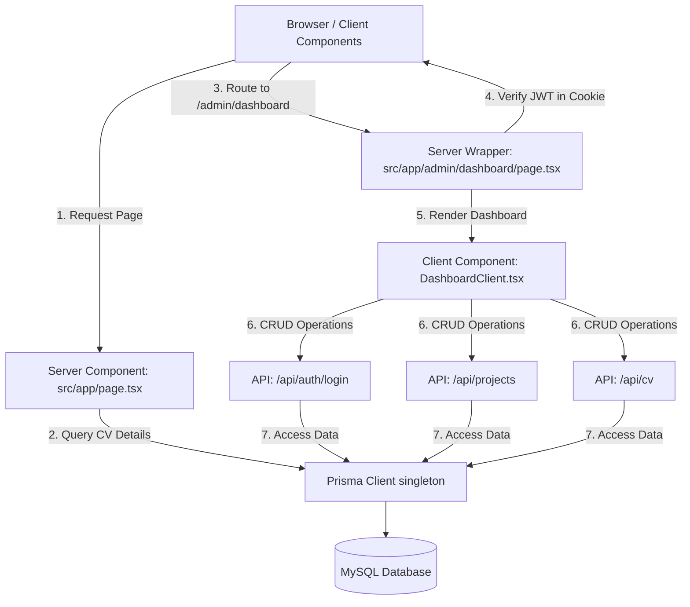
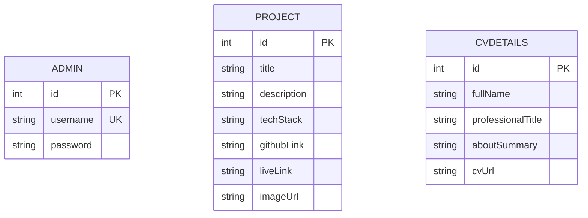
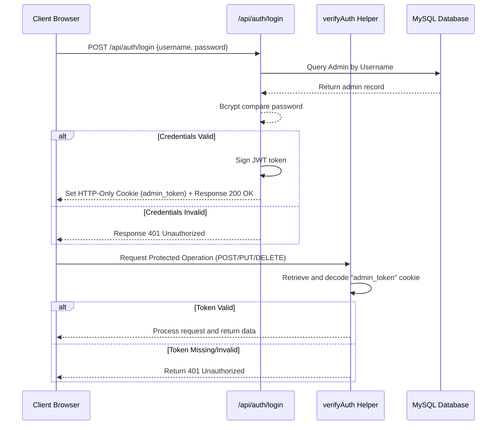

# Developer Documentation & System Architecture Manual

This document provides a comprehensive technical overview of the Next.js portfolio website codebase, database architecture, security flow, and API endpoints.

---

## 1. Technology Stack
The application is built on a high-performance modern web stack:
*   **Framework**: [Next.js 16 (App Router)](https://nextjs.org/)
*   **Database ORM**: [Prisma ORM](https://www.prisma.io/)
*   **Database Engine**: MySQL
*   **Styling**: Tailwind CSS
*   **Icons**: Lucide React
*   **Security & Hashing**: JSON Web Tokens (JWT) and BcryptJS

---

## 2. System Architecture

The following diagram visualizes how Server Components, Client Components, API routes, and the Prisma client interact with each other and the MySQL database.



---

## 3. Database Schema

The database schema is defined in `prisma/schema.prisma` and contains three main tables:



### Table Details
1.  **`Admin`**: Stores credentials for access control.
    *   `id`: Primary key (Auto-incrementing Integer).
    *   `username`: Unique identifier (String) for login.
    *   `password`: Bcrypt-hashed password (String).
2.  **`Project`**: Holds project showcase details.
    *   `id`: Primary key (Auto-incrementing Integer).
    *   `title`: Title of the project.
    *   `description`: Description of features and details (Text type).
    *   `techStack`: Comma-separated technologies (e.g., "Next.js, Prisma, MySQL").
    *   `githubLink`: Optional URL to source code.
    *   `liveLink`: Optional URL to live demo.
    *   `imageUrl`: Optional screenshot image path.
3.  **`CvDetails`**: Houses the main bio data displayed on the landing page.
    *   `id`: Primary key (Auto-incrementing Integer).
    *   `fullName`: Owner's full name.
    *   `professionalTitle`: Headline / professional title.
    *   `aboutSummary`: Biography description (Text type).
    *   `cvUrl`: Link to download CV (PDF or Drive link).

---

## 4. Security & Authentication Flow

Access protection is enforced using JSON Web Tokens (JWT) stored in HTTP-only cookies.



### Key Security Configurations
*   **HTTP-Only Cookie**: The `admin_token` cookie is set with `httpOnly: true`. This prevents client-side scripts from reading the token, mitigating Cross-Site Scripting (XSS) attacks.
*   **Secure Flag**: Set to `true` when `NODE_ENV` is in production, ensuring cookies are only sent over HTTPS.
*   **SameSite Config**: Set to `SameSite: strict` to block cross-site request forgery (CSRF) attempts.

---

## 5. API Reference

All backend code resides in the Next.js App Router API directory.

### Authentication API
#### `POST /api/auth/login`
*   **Access**: Public
*   **Payload**: `{ "username": "...", "password": "..." }`
*   **Success Response**: `200 OK` + Sets Cookie
*   **Error Response**: `401 Unauthorized` (Invalid credentials) or `400 Bad Request`

#### `DELETE /api/auth/login`
*   **Access**: Public (Logout)
*   **Operation**: Clears the `admin_token` cookie.
*   **Success Response**: `200 OK`

---

### Projects API
#### `GET /api/projects`
*   **Access**: Public
*   **Operation**: Returns a list of all projects sorted by ID descending.
*   **Response**: `{ "success": true, "data": [...] }`

#### `POST /api/projects`
*   **Access**: Protected (Requires valid JWT cookie)
*   **Payload**: `{ "title": "...", "description": "...", "techStack": "...", "githubLink"?: "...", "liveLink"?: "...", "imageUrl"?: "..." }`
*   **Response**: `{ "success": true, "data": {newProject} }`

#### `PUT /api/projects`
*   **Access**: Protected (Requires valid JWT cookie)
*   **Payload**: `{ "id": 1, "title": "...", "description": "...", "techStack": "...", "githubLink"?: "...", "liveLink"?: "...", "imageUrl"?: "..." }`
*   **Response**: `{ "success": true, "data": {updatedProject} }`

#### `DELETE /api/projects?id=[ID]`
*   **Access**: Protected (Requires valid JWT cookie)
*   **Query Param**: `id` (numeric ID of project to delete)
*   **Response**: `{ "success": true, "message": "Project deleted successfully" }`

---

### CV API
#### `GET /api/cv`
*   **Access**: Public
*   **Operation**: Returns the first record in the `CvDetails` table (falls back to a default object if table is empty).
*   **Response**: `{ "success": true, "data": {...} }`

#### `PUT /api/cv`
*   **Access**: Protected (Requires valid JWT cookie)
*   **Payload**: `{ "fullName": "...", "professionalTitle": "...", "aboutSummary": "...", "cvUrl": "..." }`
*   **Response**: `{ "success": true, "data": {updatedCv} }`

---

## 6. Directory Layout
Key files and directories in the workspace:

```text
Portfolio-Website/
├── prisma/
│   ├── schema.prisma   # MySQL Database Schema
│   └── seed.js         # Initial Database Seeder
├── public/
│   └── profile_avatar.png  # Glowing Neon Avatar
├── src/
│   ├── app/
│   │   ├── admin/
│   │   │   └── dashboard/
│   │   │       ├── DashboardClient.tsx  # Tab forms
│   │   │       └── page.tsx             # Server auth wrapper
│   │   ├── api/
│   │   │   ├── auth/login/route.ts      # Login and Logout API
│   │   │   ├── cv/route.ts              # GET / PUT CV details
│   │   │   └── projects/route.ts        # GET / POST / PUT / DELETE projects
│   │   ├── backdoor-admin/
│   │   │   └── page.tsx                 # Hidden login interface
│   │   ├── layout.tsx                   # Main global layout
│   │   └── page.tsx                     # Landing page SSR layout
│   ├── components/
│   │   ├── About.tsx             # Biography rendering
│   │   ├── ContactForm.tsx       # Message client form
│   │   ├── EducationTimeline.tsx # Vertical qualifications journey
│   │   ├── Hero.tsx              # Glowing landing section
│   │   ├── Navbar.tsx            # Sticky mobile/desktop header
│   │   └── ProjectsGrid.tsx      # Dynamic project cards fetcher
│   ├── lib/
│   │   ├── auth.ts   # JWT sign and verify helpers
│   │   └── prisma.ts # Prisma singleton client
│   └── middleware.ts # Route handling configurations
├── .env              # Environment config (DATABASE_URL, JWT_SECRET)
└── tsconfig.json     # TypeScript configurations
```
